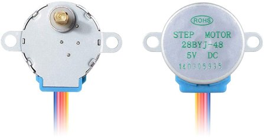
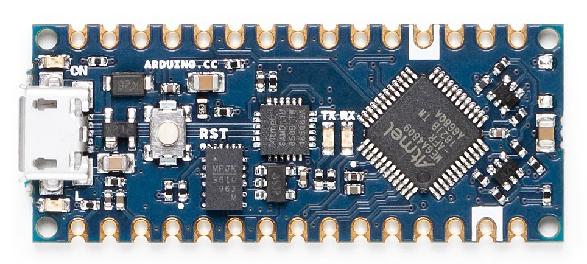
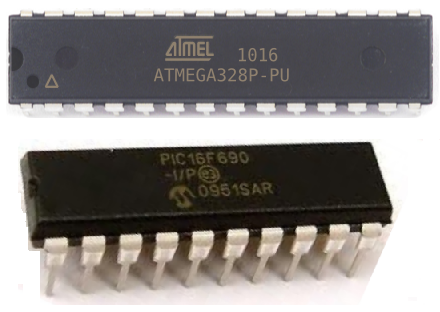

This will be a bit of a braindump of everything I've learned over the
past 48 hours. **Tl;dr** investigation into building a split-flap display
led to a deep dive into microcontrollers, stepper motors, I2C, and
something called `avrdude`. Everything I know is pretty surface level at
this point, but it's a large surface that I barely knew existed, and
I'm absolutely fascinated.

I was chatting with my wife and was curious what we had on later in
the day, so I glanced over at our [Skylight] (a wall-mounted tablet with
calendaring features) and realized that I was too far away to read it.
This led to one of us joking about needing something more analog like
a split-flap display for at-a-glance "what's next" uses. Given our
recent successes with our 3d printer, this led to the question: could
we make one ourselves? Were there pre-made designs out there?

[Skylight]: https://www.skylightframe.com/

This fairly quickly led to a number of [open source designs], and what quickly became
apparent was that the housing and flaps were the easy part of the
display. The real cost (time, money, complexity) was in the electonic
components - a stepper motor, a driver chip, a hall-effect sensor for
finding 0 degrees of rotation, and a microcontroller to tie it all
together... per letter. And that's before we consider wiring, PCBs,
solder, resistors, capacitors, and reliable power supply.

[open source designs]: https://github.com/JonnyBooker/split-flap

There are some excellent tutorials and schematics online about how to
tackle all this, so if I was content to simply follow along with what
someone had done before me and my goal was a functional display ASAP,
I could probably do that in about six weeks. The lead time for parts
is about three weeks, and then assembly and printing would eat up the
rest of the time.

[excellent tutorials]: https://splitflap.home.blog/

But that would require running someone else's code without really
understanding it, and I wanted to know more about how it worked.

## Stepper Motors

I knew from brief previous forays into robotics that a stepper motor
was fit for purpose, and tutorials agreed with me. What I didn't know
was that you drive a stepper motor by activating four electromagnets
in sequence around the center. Each full sequence rotates the rotor
some small number of degrees (like 1/64th of a revolution), and most
stepper motors are internally geared to trade speed for torque and
accuracy (like 1:64).

What really blew my mind is that you are responsible for generating
the activation pattern - 1, 2, 3, 4, 1, 2, 3, 4 - and holding the last
one so the rotor doesn't get turned by other loads. This means you
can drive in reverse, you can stop at quarter cycles, and you control
the speed. The last one is scary - go too fast and resistance on the
rotor will prevent enough rotation from happening and make the rest of
the cycle useless. I'm still not sure how to detect that is happening.

Stepper motors are used in so many applications that they are quite
cheap and relatively standardized. They're used in cars, appliances,
and CNC tools. I'm seeing 28BYJ-48 units for about a dollar or two a
unit. There appear to be other standards as well, and to be honest I
could spend a lot more time here understanding other options and how
they work, but as nothing else immediately appears at such a low price
point it's hard to believe I can do a lot better.

## Darlington Transistors

To drive those electromagnets, you typically need a higher voltage
than your microcontroller will emit on IO pins, so you need a way to
amplify the signal. I had worked with MOSFETs before, but the designs
I was seeing used a ULN2003 chip, which turned out to be a package of
seven Darlington transistor pairs. These turn out to be slightly
better suited for this specific application, and they're cheap - one
of these seems to be about fifty cents.

## Arduino

The big surprise for me was that most homebrew split-flap designs then
turned to an Arduino board to generate the activation pattern. Going
into this dive, I'd assumed there'd be another purpose-built chip that
you supplied an instruction like "turn to 60 degrees", and it would
generate the output pattern from there. I think there's two challenges
I didn't appreciate:

1. You don't just "send" an int on a single wire
2. Storing instructions requires RAM

So you use a microcontroller.

But Arduinos aren't exactly cheap. They're fantastic for prototyping,
and this dive has taught me a lot more about why that is true, but
having to have a separate Arduino board for each letter on the display
was going to balloon costs - the cheapest board I could find was $14.
When you're looking at building a display with 50 letters, suddenly
every dollar matters a lot more.

Luckily, the bill of materials on the first sample project I found had
already solved this: just buy the chip instead.

## Microchip, Amtel, and AVR

That bill of materials indicated use of an ATmega328 chip. This thing
was the real gold mine of this exploration - a 16MHz 8-bit computer
with 2KB of RAM and 32KB of instruction space for $1.50. Not only
could this thing be trivially programmed to emit the signals needed
to drive the stepper motor, it could join an I2C network and receive
instructions on what letter to display, and have IO pins leftover
for any other sensors I might need.

The manual for this thing is intense - 460 pages of specifications,
right down to the electrical characteristics of each component. It's
like the TIS-100 manual but for real life (thanks Zachtonics!)

At the same time, you can get these chips in a format where you can
stick it on a breadboard and test "simple" programs like blinking an
LED, so it seems very hands-on when prototyping. It really makes me
wish I'd been able to play with one of these when I was breadboarding
in my teens.

For reasons, the program most people use to program these is called
`avrdude`, an open source program from 2003 (and actively maintained
since) that supports all sorts of chips from Microchip/Amtel. When
I was last doing design at this level (CS 371?), this was always a
bit of a mystery to me - how does my compiled code get onto the chip.
Between the manual and this CLI, it feels a lot more tangible to me
now. Maybe I just have an affinity for CLIs.

## I2C, or TWI

The last neat thing I learned was I2C, a protocol for serial
communication along a shared, two wire bus. Often called a Two-Wire
Interface (TWI) since I2C is I guess proprietary to Philips,
the sending party is responsible for emitting a clock signal on one
line, and prefixes messages with a 7-bit address to identify the
recipient. Then data is sent one byte at a time. It's not hecking
fast, somewhere in the 100kbit/s to 3Mbit/s range, but it's really
simple to wire.

## Closing thoughts

Between 3d printing filament costs and the components listed above,
we're still under $10 a letter. I'm sure there's lots of stuff I'm
overlooking, plus time isn't free, but that helps with back of the
envelope calculations - a homemade display is probably going to cost
something like $1000. As someone this inexperienced with stuff like
this, that puts it firmly in a "second project" territory. Learning
this much has inspired some other ideas, though.

A huge thank you to the following resources for sharing their work and
inspiring this very fun exploration. I'm definitely keen to give back
if / when I do get to building my own things.

- [This Splitflap Project Blog](https://splitflap.home.blog/)

- [This GitHub Project](https://github.com/JonnyBooker/split-flap)

- [This tutorial on driving stepper motors](https://lastminuteengineers.com/28byj48-stepper-motor-arduino-tutorial/)

- [This tutorial on programming with avrdude](https://www.learningaboutelectronics.com/Articles/Programming-AVR-PIC-directly-upgrade-to-arduino.php)
