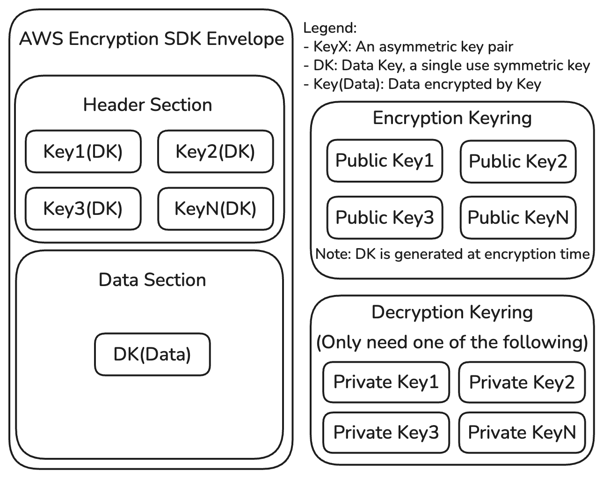
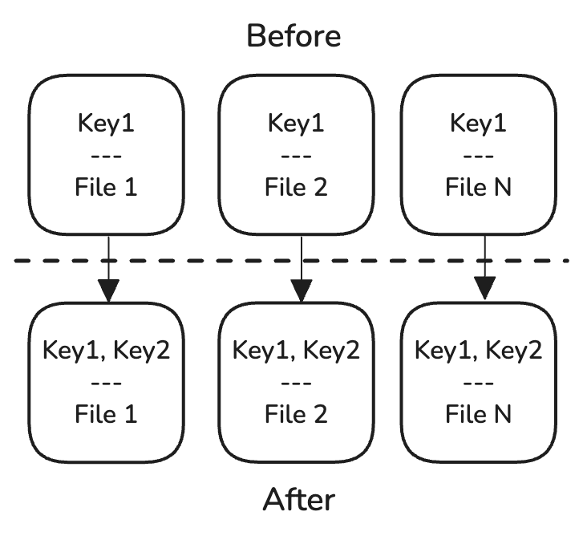
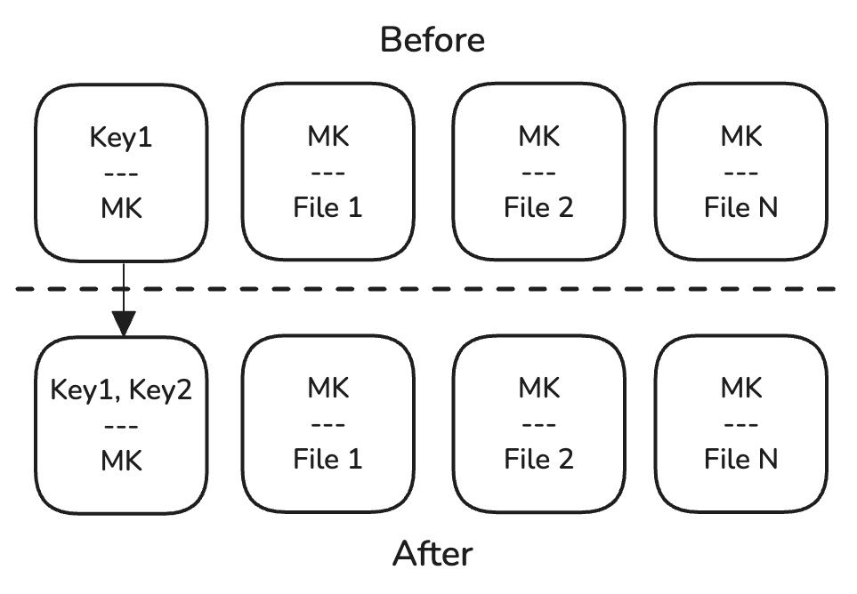
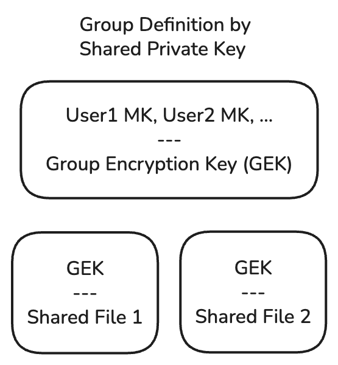

A couple years ago I started thinking about End to End Encrypted (E2EE) file storage, with a focus on web app usages (since everything else is easier). I had a few applications in mind (personal finance, code repo, file sharing), and they all had this layer in common. On top of that, I wanted the encryption to be invisible: the applications needed to be as good as unencrypted solutions. This meant I wanted a good abstraction baseline beyond which the E2EE was guaranteed.

I was reasonably familiar with [AWS's Encryption SDK](https://docs.aws.amazon.com/encryption-sdk/latest/developer-guide/introduction.html), which implements a strong encrypted blob format and is available in JS, amongst other languages. This library creates a one-time symmetric key to encrypt the actual data, then stores encrypted versions of that key in the file header. This has the advantage of allowing multiple asymmetric key pairs access a single file (both creation with public keys, and reading with any one of the private keys).

However, this only solves the very base layer of encrypting the payload. It doesn't answer how you generate the right set of public keys when creating a payload, nor where you store your private key(s) in a way that cannot be accessed by the service host. Within AWS, the KMS service solves these problems for you, but you aren't E2EE if a third party holds the keys for you. On top of that, AuthN/Z is still required for service APIs, so there's more layers to build up here.

The first problem to solve is private key storage. You could generate and store a key per machine and use the multiple-keys feature of the SDK, but this creates a need to re-encrypt each already-stored file whenever a new key is added, which is undesirable. Instead, having a single master key (MK) eliminates that concern, but creates another - how to share it amongst multiple machines? The only user-transparent way is to store it "in the cloud", but then we're right back to the 3p key problem.

A hybrid of the two approaches neatly solves this problem. Each devices generates and stores a master key encrypting key (MKEK), and then the MK is stored encrypted by each of the MKEK's public keys. In this way, adding a new device means only rewriting the encrypted MK with the newly added key, and existing encrypted data remains untouched. As an added benefit, each MKEK can be rotated independently of the MK, and password-derived MKEKs can exist as well for emergency recovery.

There's still a small problem for the browser-based approach, specifically, which is that Web Crypto doesn't currently provide a secure way to store generated keys. This means that you'll store your MKEKs in IndexedDB or similar, which does not prevent them from being exfiltrated by on-device malware. Another issue is that malicious server code can also exfiltrate MKEKs and JS SPAs are not meaningfully verifiable. Tl;dr Native apps can do better, but we can work with what we have in browser.

Now that a shared MK is setup, we can consider AuthN/Z, at least in the single-user case. So far we need users to be able to a/ read/write their encrypted MK and b/ read/write their public MKEKs to support MK encryption. We could do AuthN via the MK, but that would require public read access for the encrypted MK. While that _should_ still be secure (otherwise the E2EE isn't working), it both exposes who has accounts as well as opens up brute force attacks on all MKs.

So my preference (for now) is to use a separate IDP and passkeys for AuthN, and use that AuthN to do simple AuthZ for these critical files. This does carry the unfortunate UX burden of separate emergency recovery pathways for account (email recovery) and data (password-based MKEK), so I'm not fully dedicated to this path yet, but I think it represents the better tradeoff thus far. Thus the user signup flow can still be a traditional one, battle tested by other users of the IDP.

What about AuthZ for the other encrypted files we want to store? Well, TBH, I'm still working on that. Right now I'm getting close to a working app that uses simple [row-level security on Supabase](https://supabase.com/docs/guides/database/postgres/row-level-security), where each users' files are not shareable and so the AuthZ policy is very simple. But things get more complicated when we want to securely share files, both from an AuthZ policy as well as concepts like "who owns a group of users"? But there are promising ways forward.

Much like our multiply-encrypted MKs, we can create Group Encryption Keys, which are encrypted by multiple users' (or other groups') keys. This repeats our solution of not needing to re-encrypt all data when another accessor is added. But this means there are questions about who owns group membership - who gets to write the encrypted group key file? And if there's more than one owner, can they be meaningfully prevented from kicking another owner out?

Another problem is indexing. Being able to write blobs is great, but modern systems are fast because indexes mean we don't have to read the entire dataset to do good work. I'm working on how to support BTrees as a layer above the aforementioned framework, and it is complicated by unspecified behavior of the remote storage solution - I don't want to lock in Supabase as the only backed, for example, but I also don't want it to be insufferably slow.

I'm really interested in solutions to these problems, as well as how the same system could be used to create publicly accessible, verifiably signed information for consumption by anyone. I feel like a lot of these problems have been solved elsewhere already, so I'm mostly just trying to glean and/or steal other people's good work here, so that it can be wrapped up in a reusable package for future projects. If you know of prior art I should look at, let me know!

I want to thank [@joshcatchingfire](https://www.threads.com/@joshcatchingfire) for [his post looking for a similar solution / framework](https://www.threads.com/@joshcatchingfire/post/DMduLl0qKJQ) - I've been sitting on this idea in private for too long, and security only works when many eyes are on the implementation. Finding someone else with a similar need was the push I needed to revisit my assumptions and write up this post.
